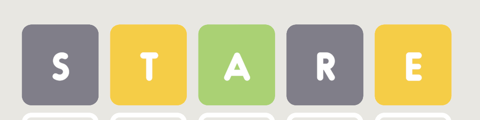

# wordle_solver
wordle solver and game to help solve wordle puzzles

## Instructions for helping you solve wordle

as of June 15, 2025, run a Jupyter notebook through box 9 and input your guesses and the responses from the game
your playing.

responses should be f letters with 'b' for black, 'y' for yellow, and 'g' for green.

### Example:



For this, enter response: `'bygby'`

## Algorithm

This uses the concept of _mutual information_, that is, what subsequent guess will break down the remaining answers into
buckets with the least amount of words per bucket. This will result in getting to the fastest answer on average.
Thus, this technique will often choose words that are not even possible in order to guarantee the least number of guesses in the
worst case scenario. In some lucky cases you could beat it, but on average it will do the best and suffer the least worst case
consequences.

To understand better, consider this scenario:

```
  8 possible words remaining:
  grand, drank, brand, crank, frank, franc, prank, dinar
  Guess 5, Try: decaf
```

The AI picks "decaf" which is not even a possible solution, but by using that word it can be determined whether
d, c, or f is in the answer and whether d is starting letter or not and where a is which allows it to break each word into
separate categories and get the anwer on the subsequent guess, whereas a naive user may pick "frank" for instance, and they
would get lucky 1/8th of the time and get the answer on the 5th guess but if the letters "rank" all came up green they
wouldn't be able to discern between prank, drank, and crank and would need a lucky guess to solve the wordle in the minimum
number of guesses.

**Note: the word list is currently set to all 5757 English 5 letter words, not the NYTimes list which is a subset (around half)**

